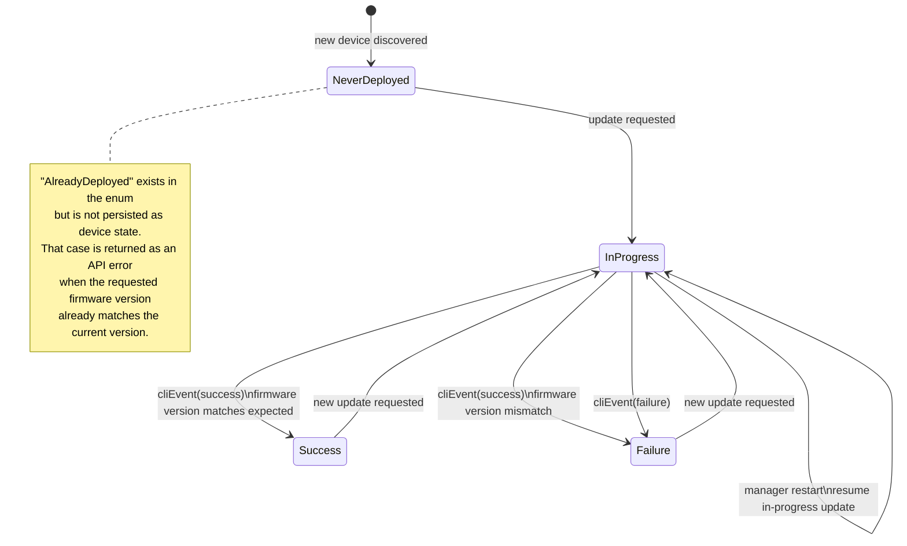

<!--
SPDX-FileCopyrightText: 2026 Ci4Rail GmbH

SPDX-License-Identifier: Apache-2.0
-->

```mermaid
stateDiagram-v2
    [*] --> NeverDeployed: new device discovered

    NeverDeployed --> InProgress: update requested
    InProgress --> Success: cliEvent(success)\nfirmware version matches expected
    InProgress --> Failure: cliEvent(success)\nfirmware version mismatch
    InProgress --> Failure: cliEvent(failure)

    Success --> InProgress: new update requested
    Failure --> InProgress: new update requested

    InProgress --> InProgress: manager restart\nresume in-progress update

    note right of NeverDeployed
      "AlreadyDeployed" exists in the enum
      but is not persisted as device state.
      That case is returned as an API error
      when the requested firmware version
      already matches the current version.
    end note
```