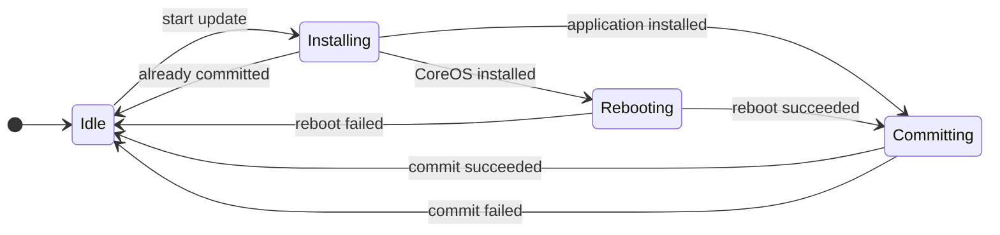
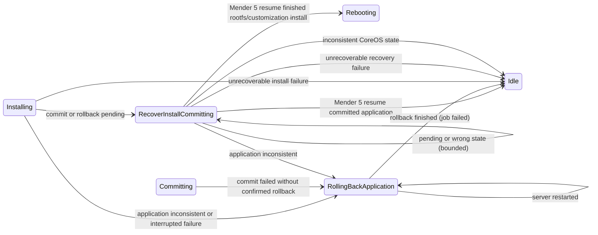

<!--
SPDX-FileCopyrightText: 2026 Ci4Rail GmbH

SPDX-License-Identifier: Apache-2.0
-->

## Normal update flow

Every transition to `Idle` emits `JobFinished`. A successful job is emitted only
after the appropriate install/commit step has succeeded.

## Recovery and retry flow

## Restart and retry rules

| State at server restart | Action |
| --- | --- |
| `Installing` | Use `mender-update resume`. |
| `Rebooting` | Retry the reboot, unless the boot ID changed; then continue with commit. |
| `Committing` | Resume the interrupted commit. |
| `RecoverInstallCommitting` | Resume within the persistent recovery limit. |
| `RollingBackApplication` | Retry Mender rollback, preserving application files. |

For an application update, one recovery-triggered re-install is permitted. The
recovery-retry count is persistent. If another recovery would be required, the
manager emits `JobFinished(failure)` and returns to `Idle`. This prevents a
deterministic package error, such as a missing Docker Compose bind-mount source,
from being retried forever.

## Mender 5 result handling

Results combine the command (`install`, `resume`, `commit`, or `rollback`), stdout summaries,
stderr diagnostics, process exit status, and execution errors. Success summaries
must appear as complete stdout lines. Failure and disposition may appear on separate lines. Streaming, installing,
and committing failures retain the system disposition: unchanged, rolled back,
or inconsistent. A successful-looking installation summary with a failed exit
status is not sufficient to continue to reboot or commit.

A Mender 5 interrupted installation must be resumed rather than committed:
`commit` can reject it with `Cannot commit from this state.`. Application resume
continues to its automatic commit. Rootfs and customization resume uses
`--stop-before ArtifactCommit_Enter` to preserve the server's reboot and
customization health-check steps before commit. The mock implements this stop
point for these payload types. A resume paused before commit can succeed without
printing an operation summary when the installation was already complete. Such
a silent result is accepted only for the explicit commit stop point and a
successful process exit.

Two commit/resume recovery operations are permitted per job; the counter survives
server restarts. This is separate from the existing single application
reinstallation allowance. Exhaustion finishes the job as failed, rather than
leaving it in progress indefinitely.

`No update in progress.` with exit code 2 may mean the updater finished before
the server persisted completion. The manager checks the requested artifact's
version against the deployed version before reporting success. A resumed
`Cleaned up.` result uses the same verification. During install
recovery, a mismatch triggers a bounded fresh installation; a commit mismatch
fails the job.

An update that was committed but has post-commit or cleanup errors stays
installed. Its deployment status is `failure`, with a diagnostic saying it was
committed and including the failed step. The manager does not clear application
directories or reinstall it. Committed summaries followed by post-commit/cleanup failure lines are treated as failures.

## Application health and rollback

Application commit and rollback commands default to a five-minute timeout.
Set `MENDER_APPLICATION_COMMIT_TIMEOUT` to a positive Go duration (for example
`10m`) to cover readiness checks, rollback and cleanup. Invalid or nonpositive
values log a warning and use the default. Other payload commit timeouts remain
30 seconds.

Pending application installs are committed so the module can run health checks.
Confirmed automatic rollback fails the job without reinstalling. An interrupted
or inconsistent failure invokes Mender rollback. Rollback failure is reported
and manifests, snapshots and transaction files are preserved for recovery.
The server never deletes application directories. Old persisted
`recover_install_clear_app` states migrate to application rollback.
The internal `.transactions` directory is excluded from application listing.
