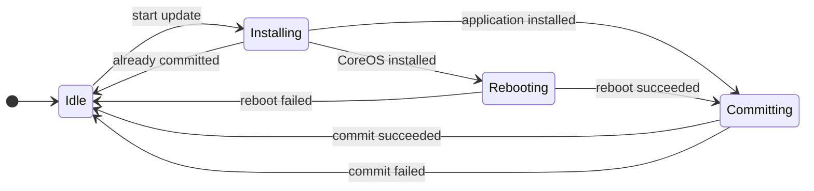
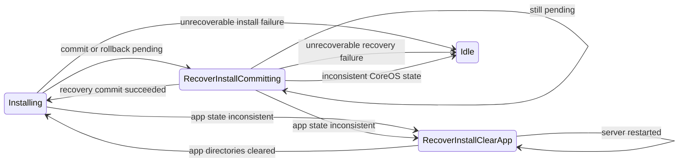

<!--
SPDX-FileCopyrightText: 2026 Ci4Rail GmbH

SPDX-License-Identifier: Apache-2.0
-->

## Normal update flow

Every transition to `Idle` emits `JobFinished`. A successful job is emitted only
after the appropriate install/commit step has succeeded.

## Recovery and retry flow

## Restart and retry rules

| State at server restart | Action |
| --- | --- |
| `Installing` | Restart the interrupted install. |
| `Rebooting` | Retry the reboot, unless the boot ID changed; then continue with commit. |
| `Committing` | Retry commit. |
| `RecoverInstallCommitting` | Retry the recovery commit. |
| `RecoverInstallClearApp` | Clear the application directories again. |

For an application update, one recovery-triggered re-install is permitted. The
recovery-retry count is persistent. If another recovery would be required, the
manager emits `JobFinished(failure)` and returns to `Idle`. This prevents a
deterministic package error, such as a missing Docker Compose bind-mount source,
from being retried forever.
