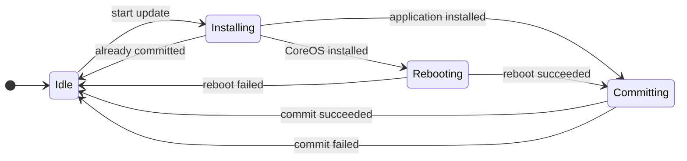
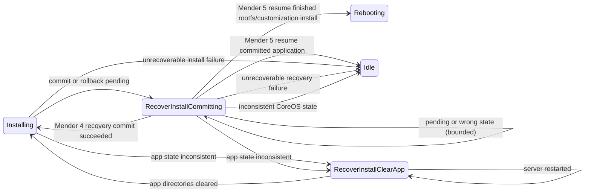

<!--
SPDX-FileCopyrightText: 2026 Ci4Rail GmbH

SPDX-License-Identifier: Apache-2.0
-->

## Normal update flow

Every transition to `Idle` emits `JobFinished`. A successful job is emitted only
after the appropriate install/commit step has succeeded.

## Recovery and retry flow

## Restart and retry rules

| State at server restart | Action |
| --- | --- |
| `Installing` | Probe `mender-update --help`. Use `resume` when advertised; otherwise restart `install`. |
| `Rebooting` | Retry the reboot, unless the boot ID changed; then continue with commit. |
| `Committing` | Retry commit. |
| `RecoverInstallCommitting` | Resume on Mender 5, or retry the recovery commit on Mender 4, within the persistent recovery limit. |
| `RecoverInstallClearApp` | Clear the application directories again. |

For an application update, one recovery-triggered re-install is permitted. The
recovery-retry count is persistent. If another recovery would be required, the
manager emits `JobFinished(failure)` and returns to `Idle`. This prevents a
deterministic package error, such as a missing Docker Compose bind-mount source,
from being retried forever.

## Mender 4 and 5 result handling

Results combine the command (`install`, `resume`, `commit`, or `rollback`), stdout summaries,
stderr diagnostics, process exit status, and execution errors. Success summaries
must appear as complete stdout lines. Mender 4's combined failure/disposition
sentences and Mender 5's separate lines are both accepted. Streaming, installing,
and committing failures retain the system disposition: unchanged, rolled back,
or inconsistent. A successful-looking installation summary with a failed exit
status is not sufficient to continue to reboot or commit.

A Mender 5 interrupted installation must be resumed rather than committed:
`commit` can reject it with `Cannot commit from this state.`. Application resume
continues to its automatic commit. Rootfs and customization resume uses
`--stop-before ArtifactCommit_Enter` to preserve the server's reboot and
customization health-check steps before commit. The mock implements this stop
point for these payload types. A resume paused before commit can succeed without
printing an operation summary when the installation was already complete. Such
a silent result is accepted only for the explicit commit stop point and a
successful process exit. Mender 4 keeps its commit/clear/reinstall recovery.

Two commit/resume recovery operations are permitted per job; the counter survives
server restarts. This is separate from the existing single application
reinstallation allowance. Exhaustion finishes the job as failed, rather than
leaving it in progress indefinitely.

`No update in progress.` with exit code 2 may mean the updater finished before
the server persisted completion. The manager checks the requested artifact's
version against the deployed version before reporting success. A resumed
`Cleaned up.` result uses the same verification. During install
recovery, a mismatch triggers a bounded fresh installation; a commit mismatch
fails the job.

An update that was committed but has post-commit or cleanup errors stays
installed. Its deployment status is `failure`, with a diagnostic saying it was
committed and including the failed step. The manager does not clear application
directories or reinstall it. This applies to both Mender 4's post-commit summary
and Mender 5's committed summary followed by post-commit/cleanup failure lines.
